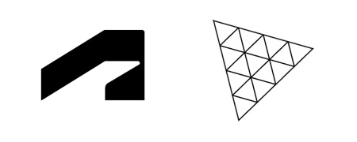

# Introduction to three.js

## Getting started (local installation of development setup)

### Prerequisites

You will need the following installed:

- node.js [Installation guide](https://nodejs.org/en/)
- A code editor of your choice (see [Code editor section](#code-editor-tips) for tips to make life easier during the course!)

### Running the code

1. Install node (see above)
2. Install yarn: `sudo npm install --global yarn`
3. Download the repository, either by `git clone https://github.com/spacemakerai/threejs-course.git` or by downloading the ZIP.
4. In a terminal, navigate to the downloaded folder and run `yarn install` or `npm install`
5. To run the code and make it listen to changes, run `yarn dev` or `npm run dev`

Open the URL that is printed to your terminal to open the webpage.
If you're seeing a completely red canvas, you're set to begin!

## Getting started (alternative using GitHub Codespaces)

An alternative to the steps above, which require you to install git/node/yarn locally on your machine, is to simply run the tutorial in the browser using [GitHub Codespaces](https://github.com/features/codespaces). This lets you access a VS Code editor in the browser, while node, yarn etc. run in a virtual machine hosted by GitHub.

### Prerequisites

- A GitHub account. 60 hours of monthly usage of GitHub Codespaces are included for free in GitHub personal accounts ([more info](https://docs.github.com/en/billing/managing-billing-for-your-products/managing-billing-for-github-codespaces/about-billing-for-github-codespaces#monthly-included-storage-and-core-hours-for-personal-accounts)).

### Steps

1. Log in to GitHub and navigate to https://github.com/spacemakerai/threejs-course
2. Click the green "Code" button in the upper-right corner
3. Click the "Codespaces" tab
4. Click "Create codespace on master". VS Code will open in a new tab
5. Wait for the codespace to start (takes up to a minute)
6. In the terminal within VS Code in the browser, run `yarn` and then `yarn dev`
7. A popup appears in the lower-right corner with the message "Your application running on port 5173 is available"
8. Click "Open in Browser". You should expect to see a red canvas in a new tab

(After you're done with the course, remember to stop/delete the codespace from the same tab where you created it, or by navigating [here](https://github.com/codespaces).)

## Now what?

Navigate to `src/main.ts` and scroll down to "TASK 1" and follow the instructions!

Good luck!

## Code editor tips

Different editors have different out-of-the-box support for the libraries we're using in this repository – see different
popular alternatives below.

In general, most editors will help you with auto-completing which parameters you need to pass in to a function – at
least after necessary dependencies [have been installed](#running-the-code). This will be very useful throughout this
course. See the different editor sections for how to see this.

### Visual Studio Code

Visual Studio Code includes TypeScript language support out-of-the-box, so no extensions are needed.

Some useful hotkeys:
| Hotkey | Windows/Linux | Mac
|---|---|---|
| See which parameters a class or a function takes in | Ctrl + Shift + Space | Shift ⇧ + Cmd ⌘ + Space |
| Go to definition | F12 / Ctrl + Click | F12 / Cmd ⌘ + Click |
| See usages | F12 / Ctrl + Click | F12 / Cmd ⌘ + Click |

### IntelliJ / WebStorm

IntelliJ and Webstorm needs the Typescript plugin installed, but by default it comes bundled, so this should work
out of the box.

Some useful hotkeys:
| Hotkey | Windows/Linux | Mac
|---|---|---|
| See which parameters a class or a function takes in | Ctrl + P | Cmd ⌘ + P |
| Go to definition | Ctrl + B / Ctrl + Click | Cmd + B / Cmd ⌘ + Click |
| See usages | Ctrl + B / Ctrl + Click | Cmd + B / Cmd ⌘ + Click |
